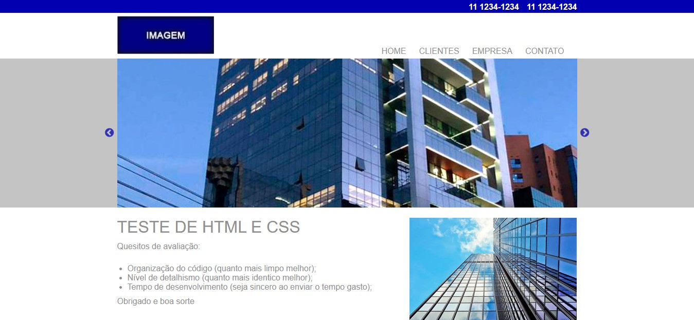
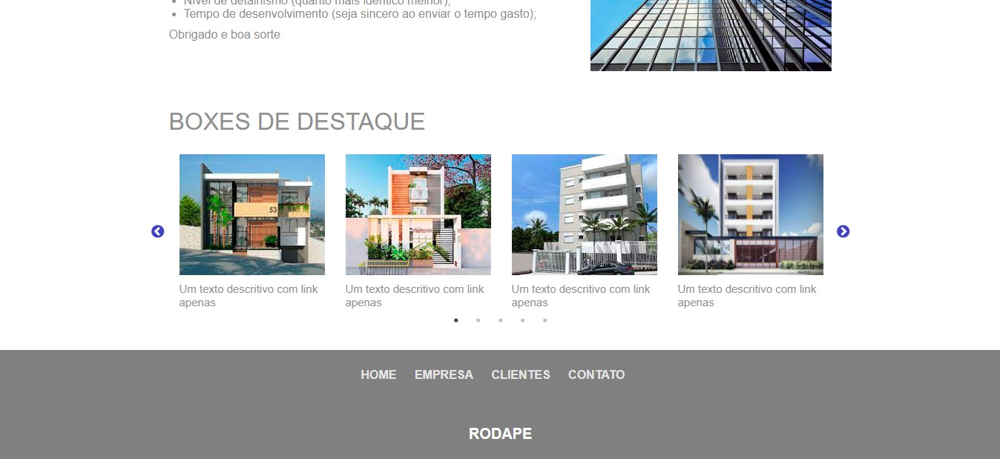

# teste-dev-front-end
<strong>Desafio - Através de um desenho previamente recebido, desenvolver a landing page utilzando HTML e CSS.</strong>

Para a criação do layout proposto no teste optei por não utilizar um framework como o bootstrap, me senti mais confortável criando o layout com html e css de uma forma mais pura e com  maior controle.

Para a criação do slider, utilizei o slick, uma biblioteca que usa o jquery.

Além disso, adicionei ao layout botões para passar o slide e achei interessante fazer o mesmo na section "boxes de destaque".

Como incremento ao projeto, o layout foi feito de forma totalmente responsiva. O tempo gasto para a criação da landing page foi de aproximadamente 7 horas, utilizei algumas imagens de prédios para que fique visualmente melhor.

<a href="https://teste-dev-front-end-nine.vercel.app/">Clique aqui para acessar o site</a>
